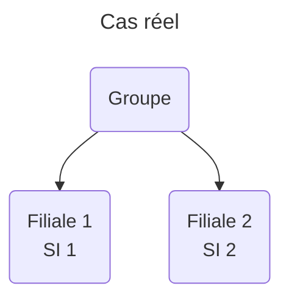
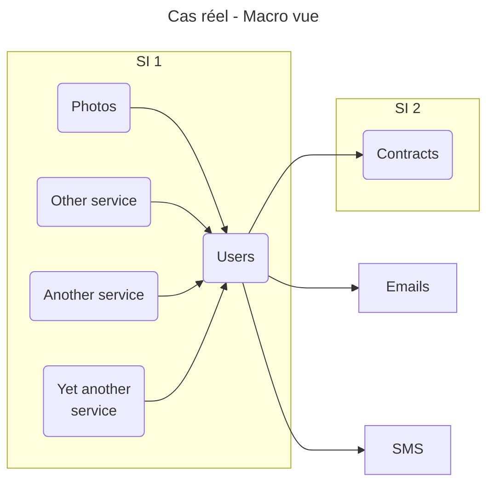

# 1. Cas réel

On va prendre un cas réel qu'on va améliorer au fil des points couverts. Il s'agira d'une application de gestion des photos.

## 1. La situation

On va considérer un groupe qui a plusieurs filiales, dont `Filiale 1` et `Filiale 2`. Chacune de ces filiales a son
propre SI. Le SI de la `Filiale 1` appelle celui de la `Filiale 2`.

On va surtout se concentrer sur le SI de la `Filiale 1`, qui est d'une taille assez conséquente avec notamment plusieurs
services qui interagissent.

## 2. En détails

Tous les services de `SI1` n'ont pas été représentés.

- `Contracts` centralise les informations liées au contrat de l'utilisateur et options qu'il a souscrit.
- `Photos` gère tout ce qui est relatif aux photos de l'utilisateur.
- `Users` centralise les informations liées à l'identité de l'utilisateur (id, email, nom, prénom etc).
  - il est appelé par quasiment tous les services du `SI 1` => c'est un SPOF.
  - il a des rôles divers, autres que centraliser tout ce qui est lié à l'identité de l'utilisateur (envoyer des mails).

La plupart de ces services dispose de leur propre base de données.
