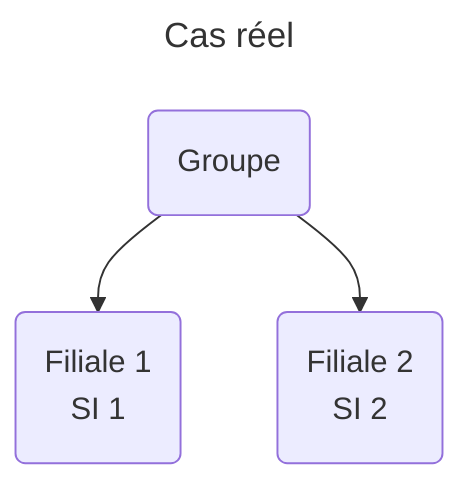
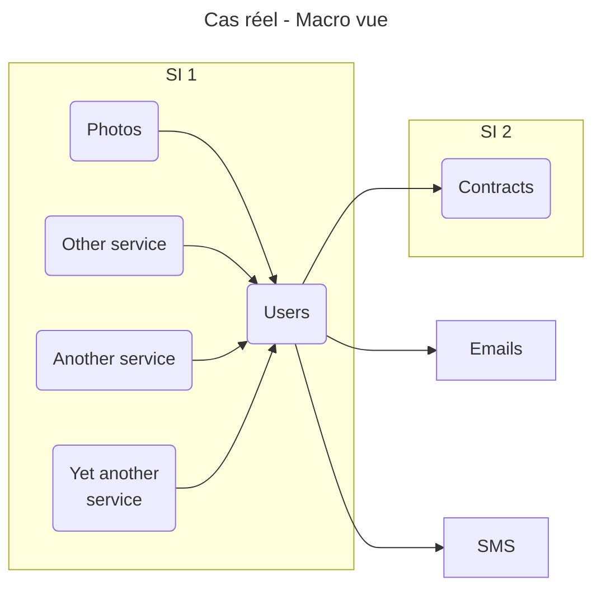

# 1. Cas existant

On va prendre un cas réel qu'on va améliorer au fil des points couverts. Il s'agira d'une application de gestion des photos.

## 1. La situation

- `SI 1`:
  - appartient à une filiale d'un groupe
  - SI d'une taille assez conséquente avec plusieurs services qui intéragissent
- `SI 2`:
  - appartient à une autre filiale du groupe.

## 2. En détails

- `Users` centralise les informations liées à l'identité de l'utilisateur (id, email, nom, prénom etc).
- `Contracts` centralise les informations liées au contrat de l'utilisateur et options qu'il a souscrit.
- `Photos` gère tout ce qui est relatif aux photos de l'utilisateur.

La plupart de ces services dispose de sa propre base de données.

_A noter:_ `Users` est appelé par quasiment tous les services du `SI 1`, services qui n'ont pas tous été representés.
