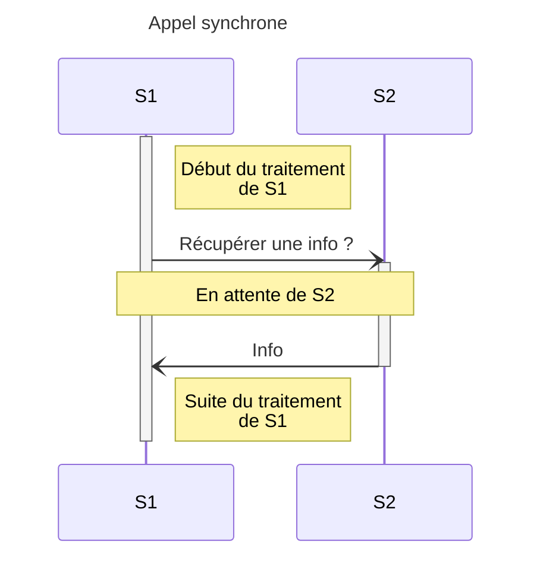
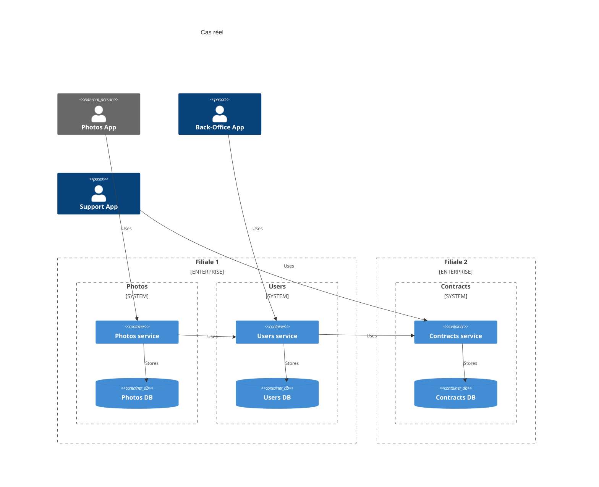
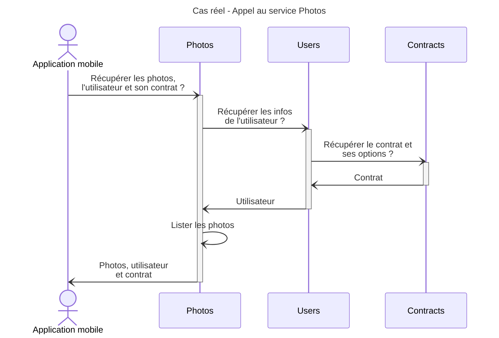
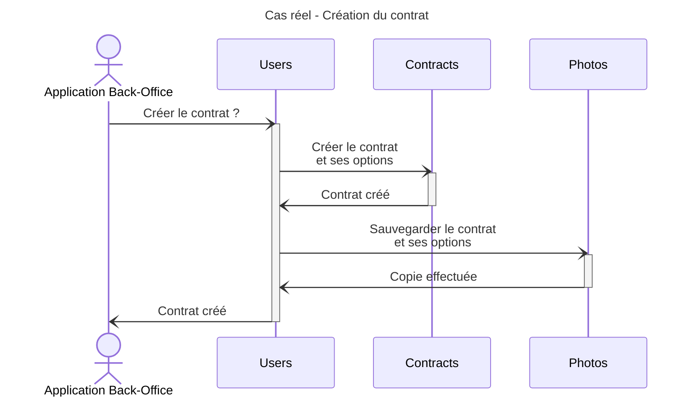
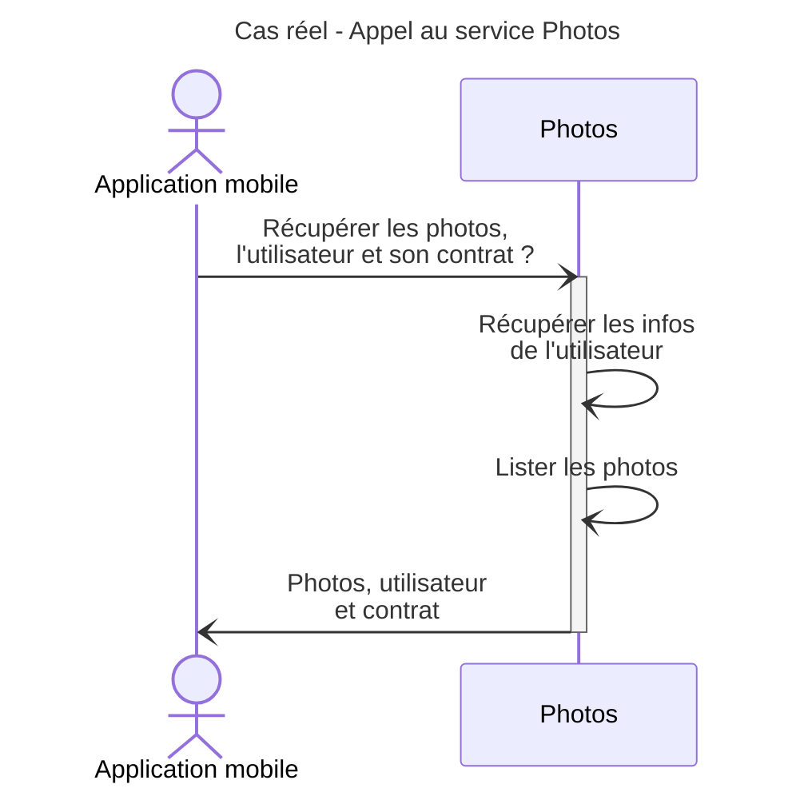
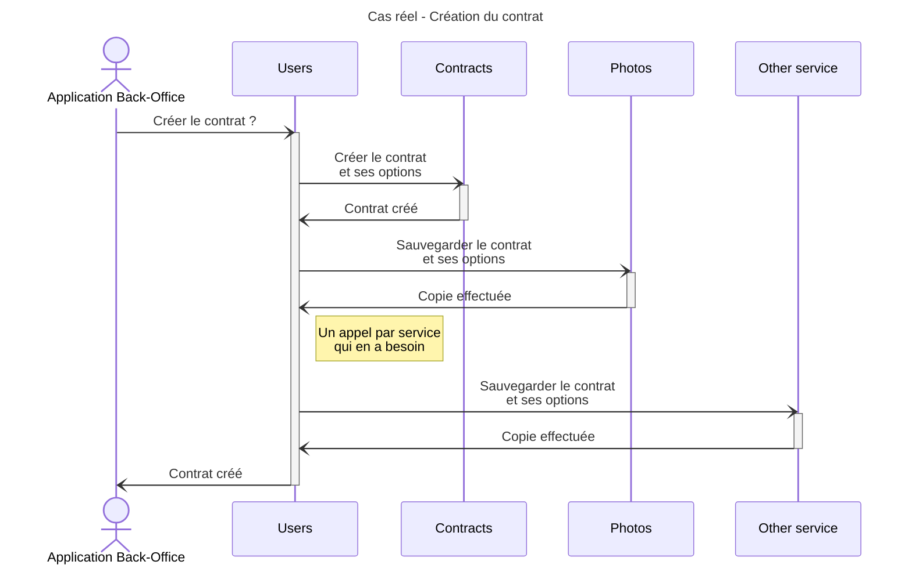

# 2. Appels synchrones

## 1. Qu'est ce que ça veut dire ?

Un service `S1` appelle un 2ème service `S2`. Il va attendre le résultat pour la suite de son traitement.

### Pourquoi faire ça ?

- Quand on a besoin d'avoir la réponse pour poursuivre le traitement.
- Quand on veut être sûr qu'une action s'est bien terminée pour poursuivre le traitement.

### Avantages

- Le résultat obtenu est à jour.
- On a la garantie que le traitement de `S2` s'est correctement effectué.

### Inconvénients

- Le traitement de `S1` est en pause le temps que `S2` réponde.
- Gestion des erreurs si :
  - `S2` est down
  - `S2` est trop long (timeout)

## 2. Dans notre situation réelle

L'utilisateur veut, via son application mobile, afficher sa liste de photos.

[Maquette](https://www.figma.com/file/Wx4WtmrKsUsHAtiedGGZMQ/Asynchrone?node-id=4%3A74&t=rEqGLtgCcFsp1KDf-4)

Photos de [Pixabay](https://pixabay.com)

### Les questions qu'on peut se poser

1. qu'est ce qui se passe si beaucoup d'utilisateurs récupèrent les données ?
2. qu'est ce qui se passe si `Users` est down ou surchargé ?
3. qu'est ce qui se passe si `Contracts` est down ou surchargé ?

### Les problèmes possibles

1. on aura des lenteurs à chaque appel car on se retrouve à appeler toute une chaîne de services.
2. on risque une erreur à chaque appel de cette chaîne
3. le déploiement d'évolutions sera potentiellement complexe car chaque service dépend du suivant

### Amélioration

Actuellement, on a 2 contraintes:

1. `Contracts` est la source des informations de contrat et des options souscrites.
2. `Users` est le point d'accès à `Contracts`.
3. `Photos` a besoin de ces informations.

Donc, on va commencer par déplacer le problème:

1. `Contracts` va rester la source des informations de contrat et des options souscrites.
2. `Users` va rester le point d'accès à `Contracts`.
3. `Photos` va conserver une copie de ces informations, copie qui sera rafraichie à chaque changement.

Pour résoudre ça, on va créer un process automatique, à base de webhooks. Il sera appelé à la création du contrat et à
chaque modification de celui-ci ou d'une option.

#### Qu'est ce que ça change

Ça va permettre de limiter les appels entre `Photos` et `Users`. Par contre, qui dit mise en cache, dit cache à maintenir
coté `Photos`.

#### Les défauts

Si chacun des services appelant `Users` veut garder une copie du contrat, c'est autant de services
à appeler à la création ou au changement.

