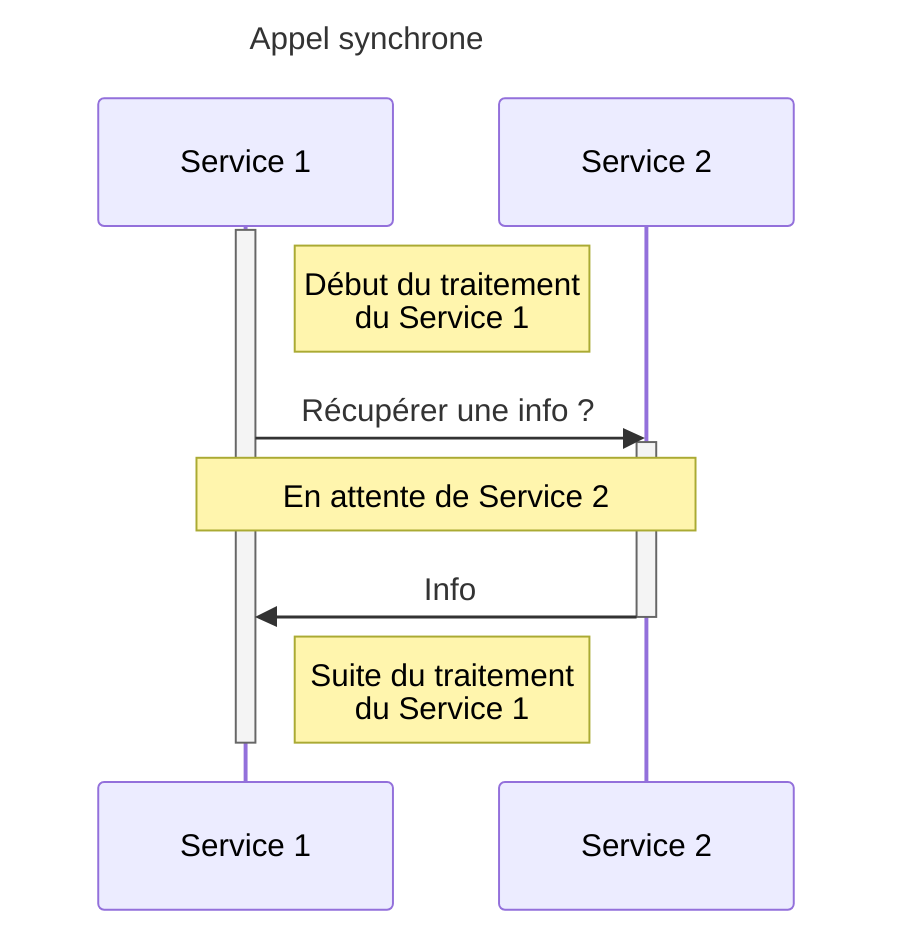
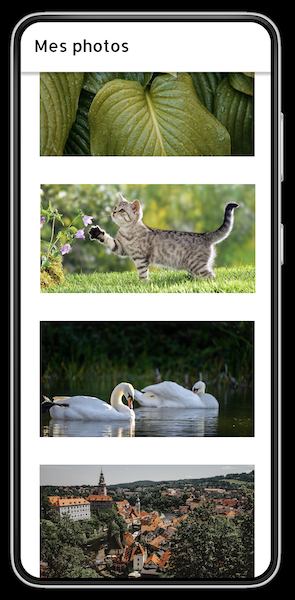
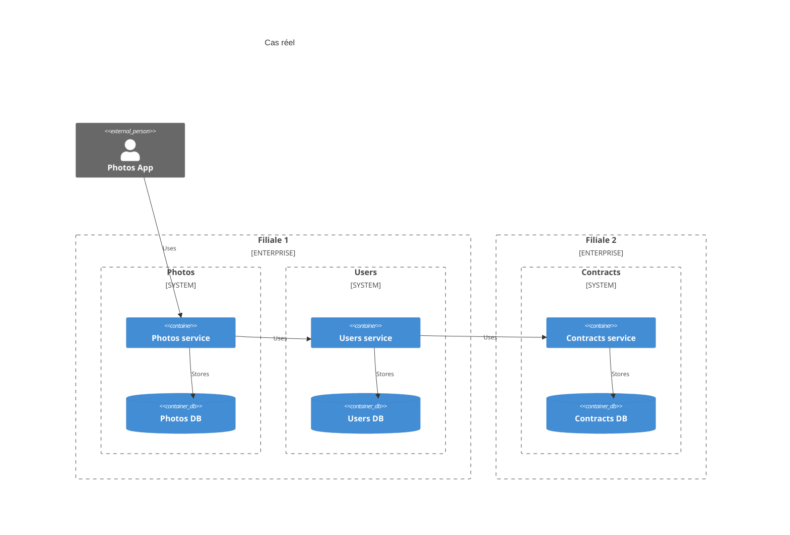
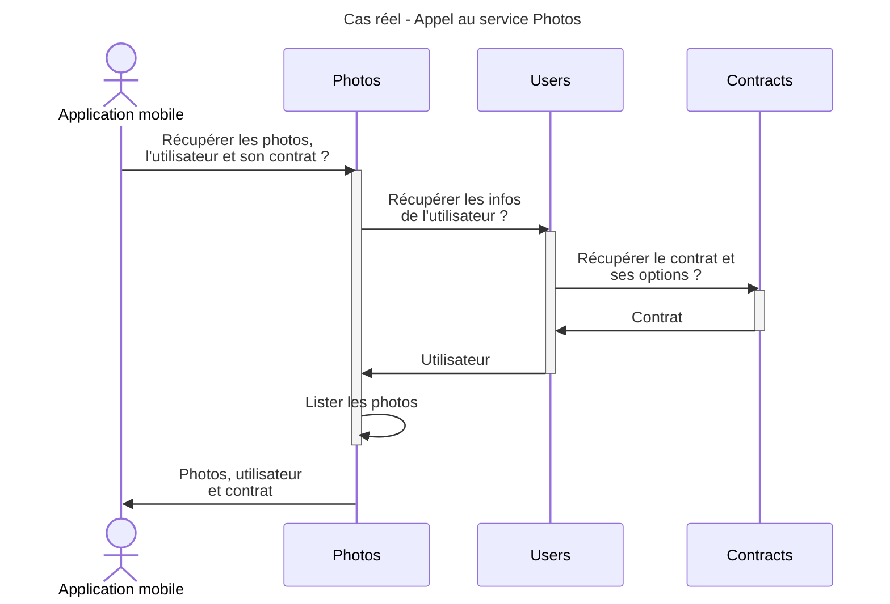

# 2. Appels synchrones

## 1. Qu'est ce que ça veut dire ?

Un service `Service 1` appelle un 2ème service `Service 2`. Il va attendre le résultat pour la suite de son traitement.

### Pourquoi faire ça ?

- Quand on a besoin d'avoir la réponse pour poursuivre le traitement.
- Quand on veut être sûr qu'une action s'est bien terminée pour poursuivre le traitement.

### Avantages

- Le résultat obtenu est à jour.
- On a la garantie que le traitement de `Service 2` s'est correctement effectué.

### Inconvénients

- Le traitement de `Service 1` est en pause le temps que `Service 2` réponde.
- Gestion des erreurs si :
  - `Service 2` est down
  - `Service 2` est trop long (timeout)

## 2. Dans notre situation réelle

L'utilisateur veut, via son application mobile, afficher sa liste de photos.

[Maquette](https://www.figma.com/file/Wx4WtmrKsUsHAtiedGGZMQ/Asynchrone?node-id=4%3A74&t=rEqGLtgCcFsp1KDf-4)

Photos de [Pixabay](https://pixabay.com)

### Les questions qu'on peut se poser

- qu'est ce qui se passe si beaucoup d'utilisateurs récupèrent les données ?
- qu'est ce qui se passe si `Users` est down ou surchargé ?
- qu'est ce qui se passe si `Contracts` est down ou surchargé ?

### Les problèmes possibles

- lenteurs à chaque appel
- Erreur à chaque appel
