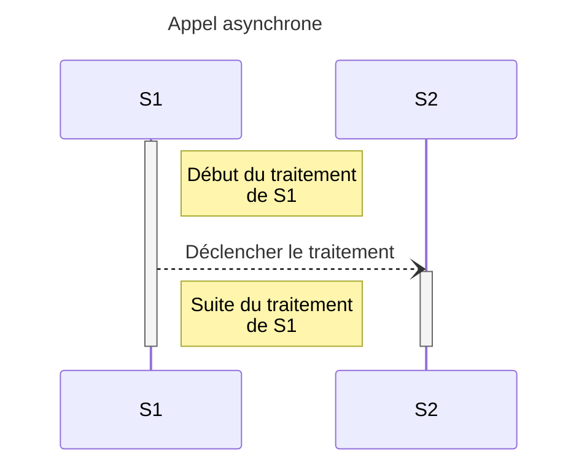
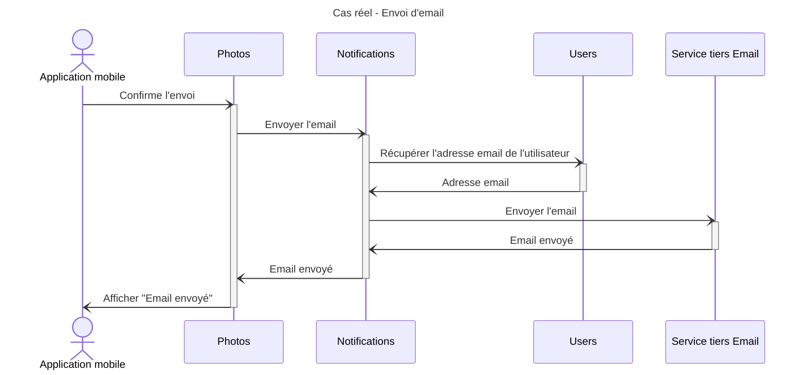
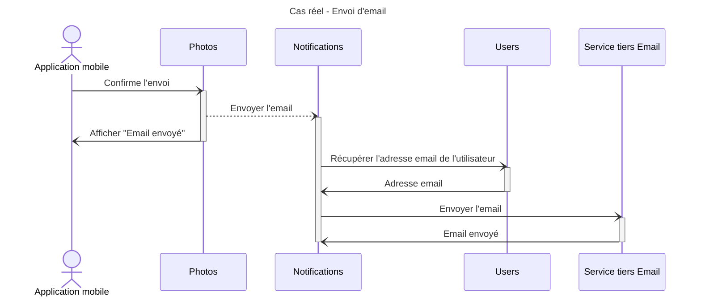

# 3. Appels asynchrones

## 1. Qu'est ce que ça veut dire ?

Un service `S1` déclenche un traitement sur un 2ème service `S2`. Il ne va pas attendre le résultat
pour la suite de son traitement.

### Pourquoi faire ça ?

- Quand on n'a pas besoin d'être sûr que le traitement de `S2` se soit bien passé
- Quand on veut déclencher des traitements longs

### Avantages

- Pas de temps d'attente pour `S1`

### Inconvénients

- On ne sait pas si le traitement de `S2` s'est bien terminé

## 2. Dans notre situation réelle

L'utilisateur veut, via son application mobile, partager une photo par email à un ami.

[Maquette](https://www.figma.com/file/Wx4WtmrKsUsHAtiedGGZMQ/Asynchrone?node-id=8%3A78&t=rEqGLtgCcFsp1KDf-4)

Photos de [Pixabay](https://pixabay.com)

### Proposition

On pourrait le faire en synchrone.

#### Les questions qu'on peut se poser

1. est ce qu'il est utile d'attendre la confirmation d'envoi ?
2. pourquoi `Users` envoie-t'il les emails ?
3. qu'est ce qui se passe si `Users` est down ou surchargé ? Ce qui peut arriver encore plus rapidement si `Users` centralise
   beaucoup trop de logique diverse.

### 1ère amélioration

On va d'abord extraire de `Users` la logique associée à l'envoi de notifications et la mettre dans un service `Notifications`.
Ça incluera l'envoi d'email et de SMS.

#### Les défauts

1. on attend toujours le résultat de l'envoi pour pouvoir poursuivre le traitement de `Photos`.
2. on a créé `Notifications` qui est devenu un point central d'envoi de notification. Bloquer le traitement de `Notifications`
   va être génant pour les autres service qui souhaiteraient envoyer des notifications, en même temps.

### 2ème amélioration

On va déclencher l'appel à `Notifications` de manière asynchrone. Ça permettra d'éviter que `Photos` attende le résultat
de l'envoi de l'email.

#### Les défauts

1. d'un point de vue `Photos`, on n'est pas sûr que l'email ait vraiment été envoyé. Donc on va encore améliorer ça.
2. `Notifications` est trop central. En cas d'erreur ou de surcharge, on n'a plus aucun envoi de notifications.
