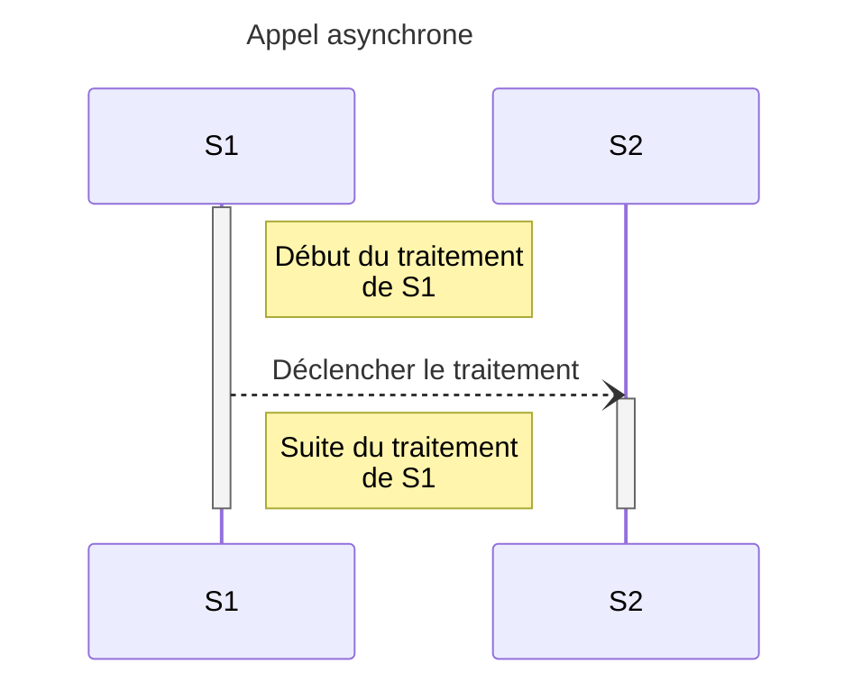
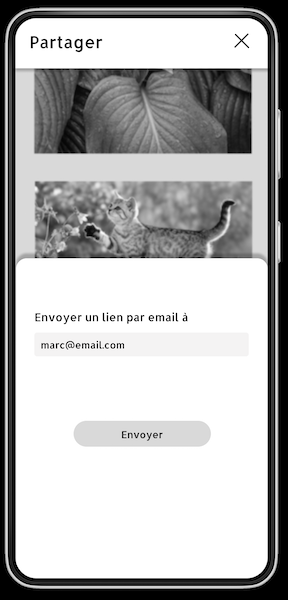
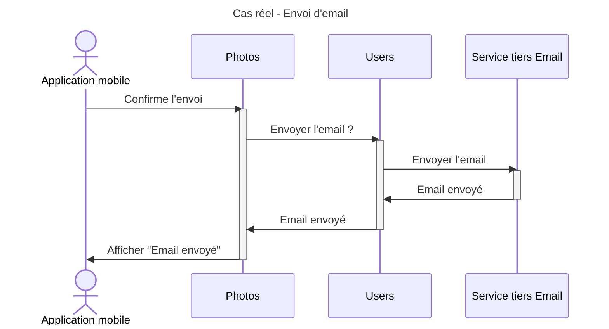
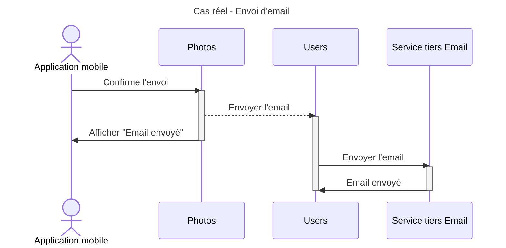

# 3. Appels asynchrones

## 1. Qu'est ce que ça veut dire ?

Un service `S1` déclenche un traitement sur un 2ème service `S2`. Il ne va pas attendre le résultat
pour la suite de son traitement.

### Pourquoi faire ça ?

- Quand on n'a pas besoin d'être sûr que le traitement de `S2` se soit bien passé
- Quand on veut déclencher des traitements longs

### Avantages

- Pas de temps d'attente pour `S1`

### Inconvénients

- On ne sait pas si le traitement de `S2` s'est bien terminé

## 2. Dans notre situation réelle

L'utilisateur veut, via son application mobile, partager une photo par email à un ami.

[Maquette](https://www.figma.com/file/Wx4WtmrKsUsHAtiedGGZMQ/Asynchrone?node-id=8%3A78&t=rEqGLtgCcFsp1KDf-4)

Photos de [Pixabay](https://pixabay.com)

### 1ère version

On pourrait le faire en synchrone.

#### Les questions qu'on peut se poser

- est ce qu'il est utile d'attendre la confirmation d'envoi ?
- qu'est ce qui se passe si `Users` est down ou surchargé ?

### Amélioration

#### Qu'est ce que ça change

`Photos` n'attend plus la confirmation d'envoi de l'email

#### Les défauts

D'un point de vue `Photos`, on n'est pas sûr que l'email ait vraiment été envoyé. Donc on va encore améliorer ça.
