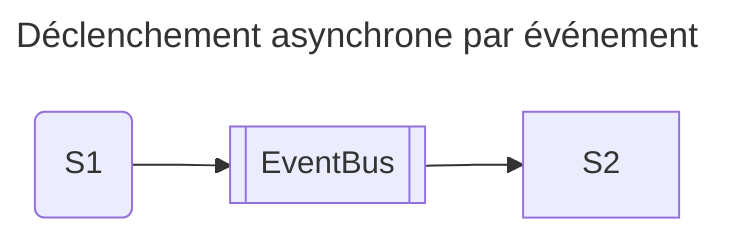
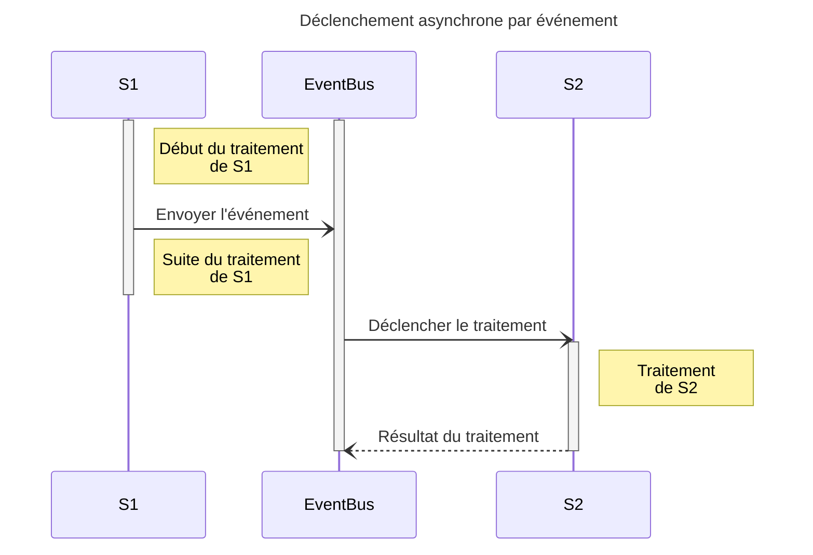
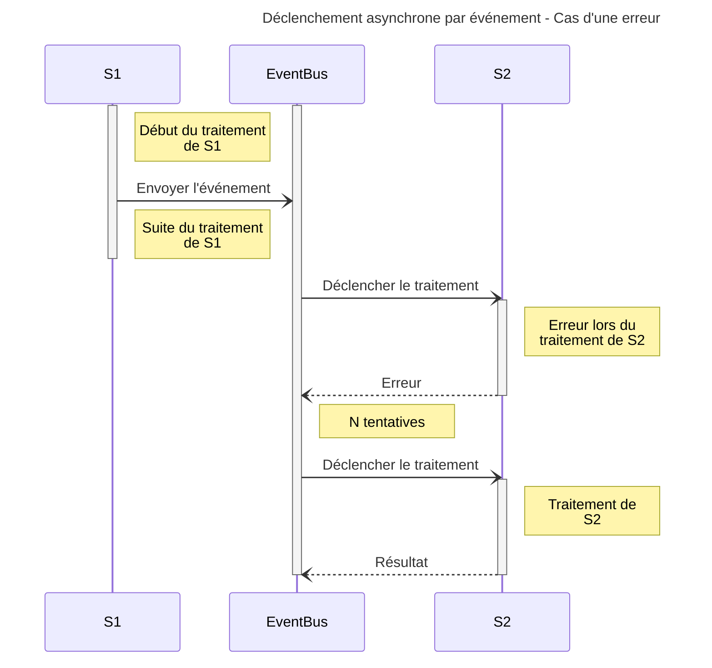
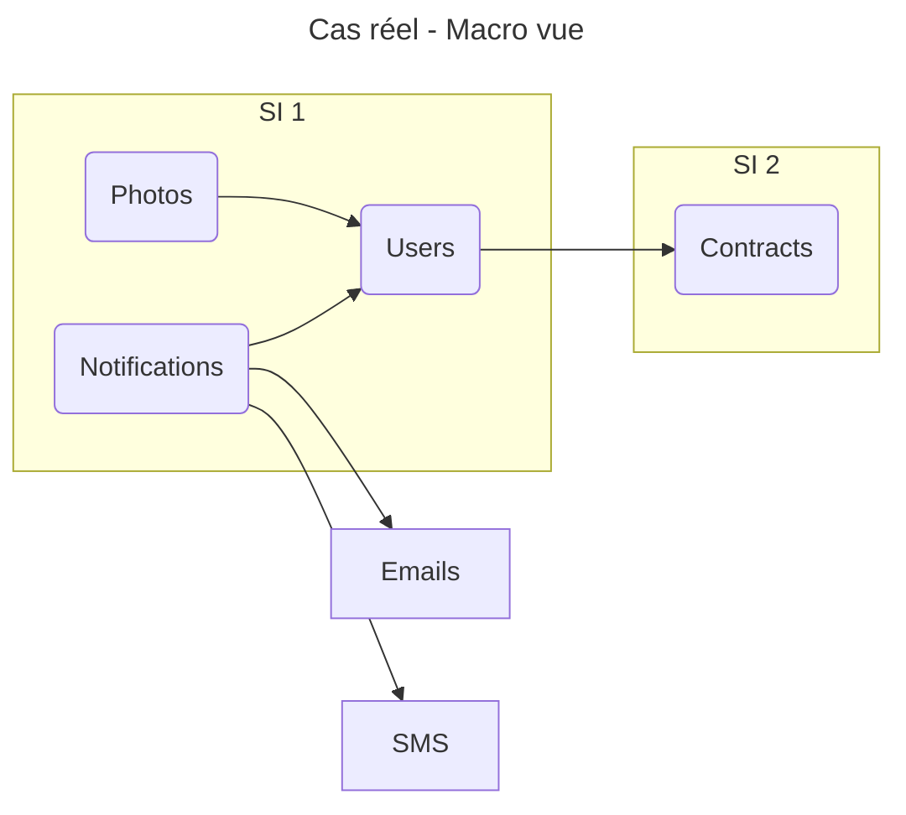
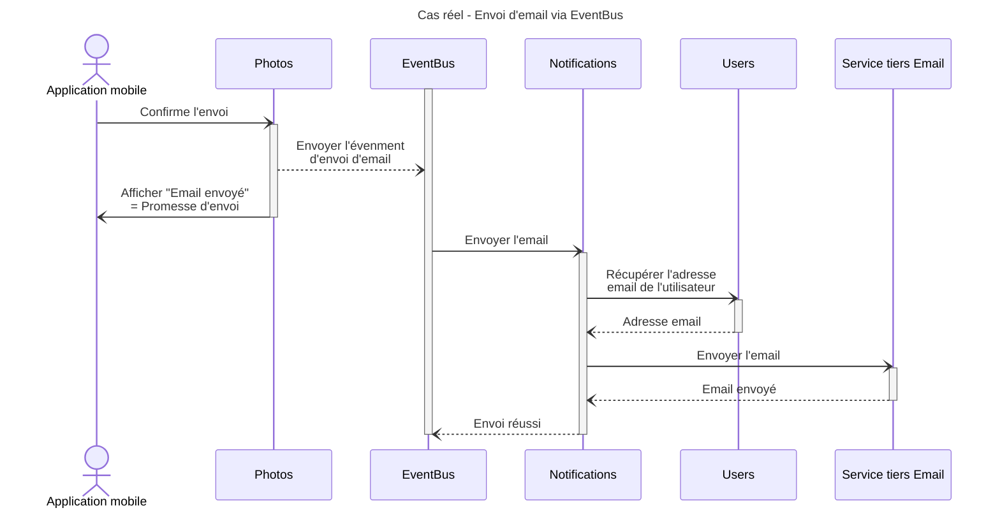
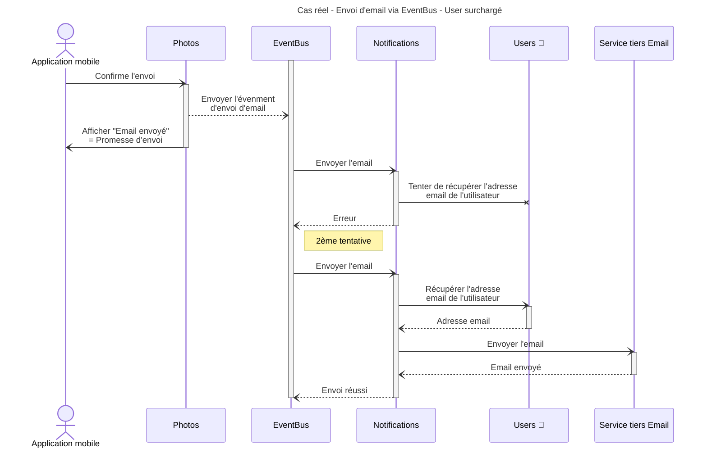

# 4. Utilisation des événements

## 1. Qu'est ce que ça veut dire ?

Comme on vient de le voir, il y a des situations où on va avoir besoin d'être sûrs qu'un traitement soit fait, même si
on ne souhaite pas en attendre la fin.

Dans ce genre de situation, on va avoir recours à un système par événements. Lors de son execution, `S1` va déposer un
"jeton" (un événement) dans une queue. Ce jeton sera traité par un consommateur.

### Pourquoi faire ça ?

L'intéret de ce genre de système est de pouvoir séparer la responsabilité d'executer correctement le traitement de `S2`
du traitement de `S1`.

### Avantages

- Suivant sa configuration, la queue gèrera elle-même les tentatives en cas d'erreur.
- On peut mettre un système d'alerte pour notifier en cas de dépassement du nombre de tentatives

### Inconvénients

- On ne sait pas si le traitement de `S2` s'est bien terminé

Toujours le même inconvénient: `S1` ne sait pas si le traitement de `S2` a eu lieu => impose de se poser les questions autrement.

## 2. Dans notre situation réelle

On reprend notre cas d'usage précédent: l'utilisateur veut, via son application mobile, partager une photo par email
à un ami.

[Maquette](https://www.figma.com/file/Wx4WtmrKsUsHAtiedGGZMQ/Asynchrone?node-id=8%3A78&t=rEqGLtgCcFsp1KDf-4)

Photos de [Pixabay](https://pixabay.com)

### Amélioration

On va déclencher `Notifications` via un événement et non plus directement. Ça permettra de déméler un peu le sac de noeuds
fait précédemment.

#### Qu'est ce que ça change

1. `Photos` n'attend plus la confirmation d'envoi de l'email => On **promet** l'envoi de l'email à notre utilisateur.
2. `Photos` n'a plus besoin de parler à `Notifications` pour **demander** l'envoi de l'email => dépendance de déploiement
   en moins
3. C'est le service `Notifications` qui a la connaissance pour tout ce qui est envoi d'emails. D'ailleurs `Notifications`
   pourrait aussi bien envoyer un SMS qu'un email.
4. Le bus d'événements se charge de resseayer l'envoi en cas d'erreur dans le traitement de `Notifications`

#### Les défauts

- Une queue de traitement, qui déclenche forcément Notifications => la queue doit connaitre Notifications
- Charge de `Notifications` si beaucoup d'envois
