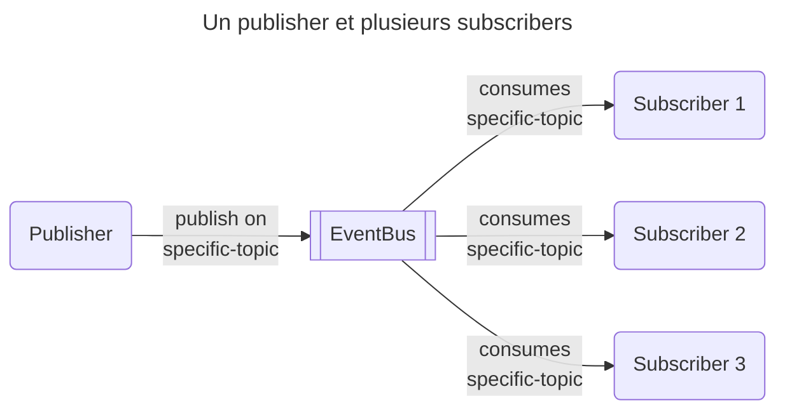
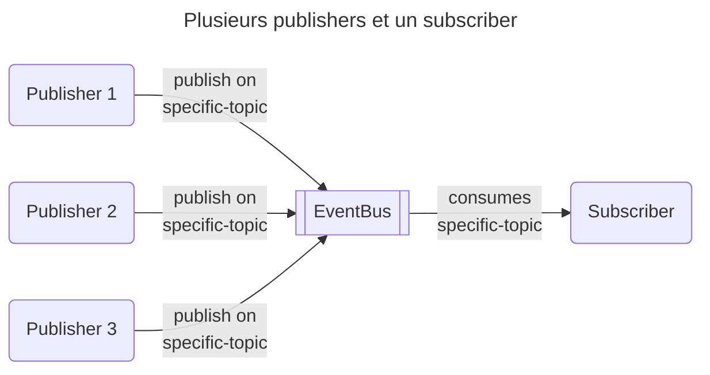
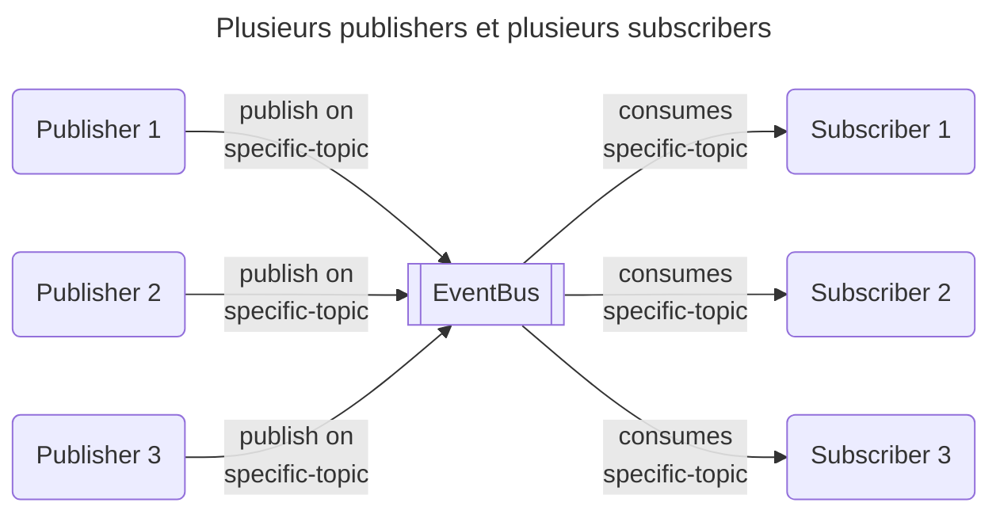
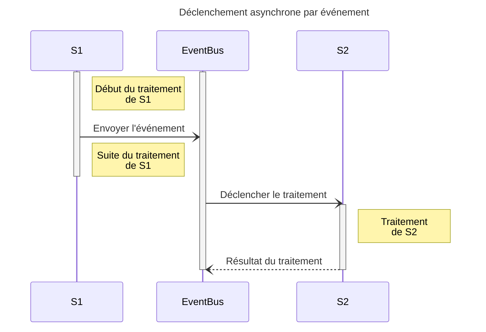
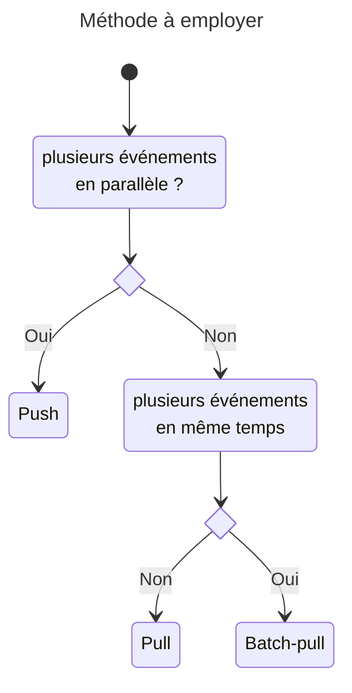
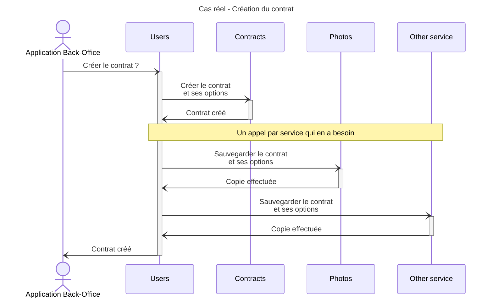
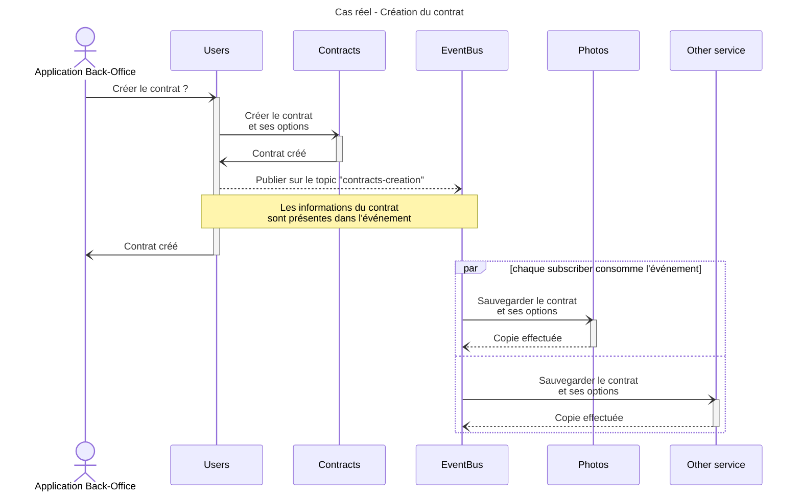

# 5. Publisher / Subscriber

## 1. Qu'est ce que ça veut dire ?

Pour pouvoir traiter ces événements, on peut s'appuyer sur le modèle publisher / subscriber. Les consommateurs (subscribers)
vont s'inscrire auprès du bus d'événements comme étant prêts à consommer les événements d'un certain topic.

On va souvent se retrouver dans 3 situations:

1. Un publisher et plusieurs subscribers
2. Plusieurs publishers et un subscriber
3. Plusieurs publishers et plusieurs subscribers

Si on reprend le schéma précédent, avec le principe de publisher / subscriber, `S1` n'a pas besoin de savoir que `S2` sera
celui qui va exécuter le traitement. Il a juste l'assurance que quelqu'un le fera.

### Qu'est ce que ça implique ?

Suivant la configuration choisie, les consommateurs vont consommer différemment les événements:

- le push: le consommateur sera déclenché automatiquement par le bus dès qu'un évenement est disponible.
- le pull: le consommateur viendra régulièrement vérifier **si un événement est disponible**

Certaines plateformes fournissent aussi le `batch-pull`. Le consommateur viendra régulièrement vérifier **si un lot
d'événements est disponible**

Pour choisir la méthode, il faut répondre à plusieurs questions:

1. est-ce que je peux traiter plusieurs événements en parallèle ?
2. quelle la fréquence de cet événement ?

Si la réponse à la 1ère question est oui, alors on peut envisager de faire du `push`. L'avantage principal étant que le
consommateur sera notifié par l'event bus. Il n'y a rien à prévoir en plus.

Si non, alors on n'a pas d'autre choix que de faire du `pull`. Ca permettra au service consommateur de traiter les événements
à son propre rythme. Par contre, il faudra mettre en place un système manuel pour vérifier si un événement est disponible.

Si on en a la possibilité et qu'on souhaiter grouper les événements, on peut utiliser la méthode du `batch-pull`.

## 2. Dans notre situation réelle

On reprend notre cas d'usage du début: l'utilisateur veut, via son application mobile, afficher sa liste de photos.

[Maquette](https://www.figma.com/file/Wx4WtmrKsUsHAtiedGGZMQ/Asynchrone?node-id=4%3A74&t=rEqGLtgCcFsp1KDf-4)

Photos de [Pixabay](https://pixabay.com)

On avait mis en place un système de cache coté `Photos` pour limiter les appels vers `Users` et `Contracts` à chaque
affichage de la liste. Mais ce cache demandait une maintenance automatique de celui-ci.

### Amélioration

Au lieu d'appeler directement chacun des services, `Users` va maintenant publier un événement, événement qui sera consommé
par qui en a besoin.

#### Qu'est ce que ça change

`Users` n'a qu'un seul événement à envoyer. De plus, il n'a pas besoin de se préoccuper de qui le consommera. L'eventBus
se chargera lui-même de gérer la consommation par les différents subscribers.

#### Les défauts
