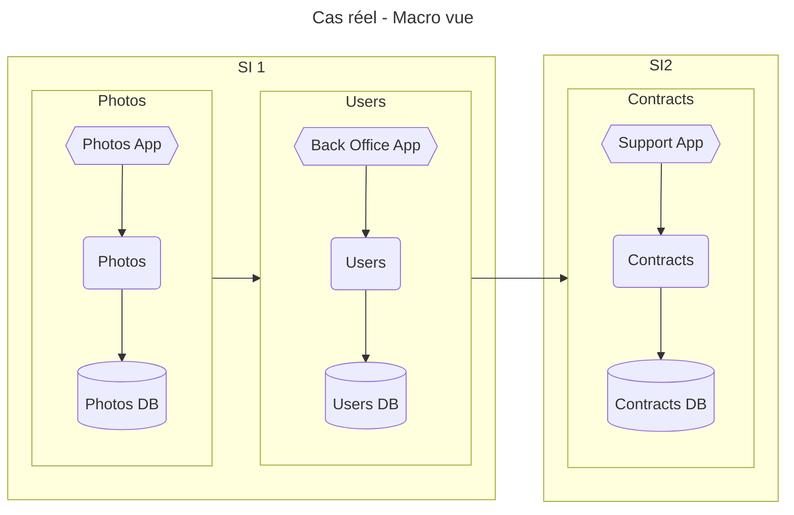
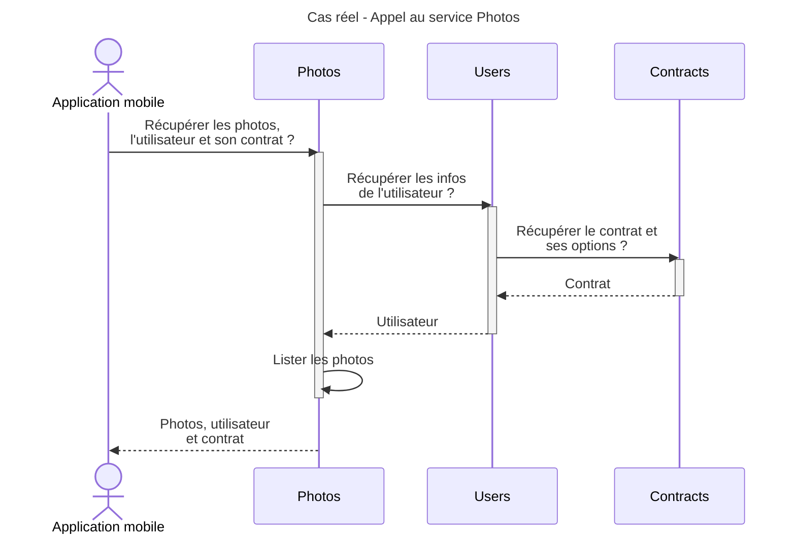
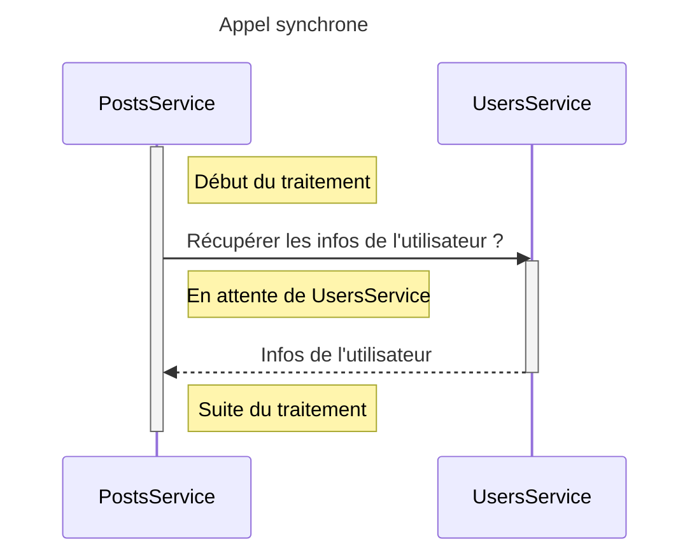
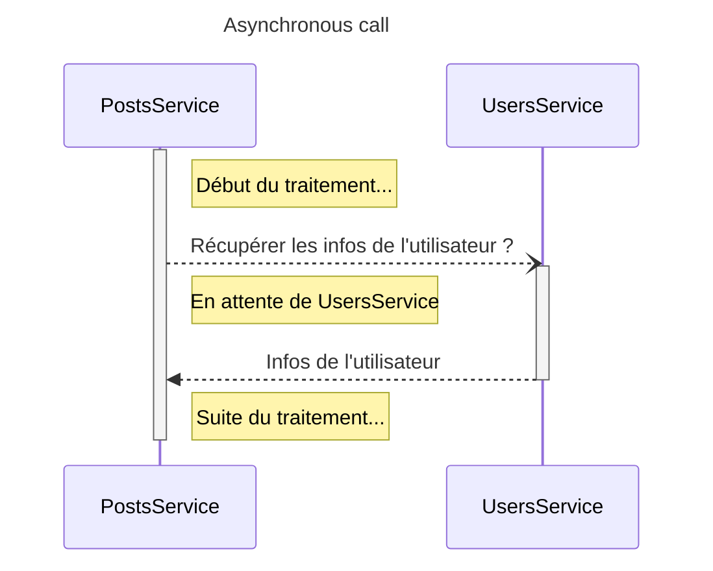

# Asynchrone / Events

## Cas existant d'une application de gestion des photos

A affiner:

* Posts ou Photos ?

***A enrichir en fonction de la suite***

* `SI 1`:
* `SI 2`:
  * appartient à une autre filiale du groupe.
  * source de la donnée des contrats.

Les problèmes:

* lenteurs à chaque appel
* qu'est ce qui se passe si `Users` ou `Contracts` est down ou surchargé ?
* qu'est ce qui se passe si beaucoup d'utilisateurs récupèrent les données ?

## 1. Expliquer synchrone vs asynchrone

### 1. Appels synchrones ?

Un service `PostsService` appelle un 2ème service `UsersService`. Il va attendre le résultat pour la suite de son traitement.

#### Pourquoi faire ça ?

Ca peut être nécessaire de faire ainsi si on a besoin d'une info pour la suite du traitement.

#### Avantages

* Le résultat obtenu est à jour

#### Inconvénients

* Le traitement de `PostsService` est interrompu le temps que `UsersService` réponde
* Gestion des erreurs si :
  * `UsersService` est down
  * `UsersService` est trop long (timeout)

### 2. Appels asynchrones ?

Un service `PostsService` déclenche un traitement sur un 2ème service `UsersService`. Il ne va pas attendre le résultat
pour la suite de son traitement.

#### Pourquoi faire ça ?

#### Avantages

* Pas de temps d'attente pour `PostsService`

#### Inconvénients

* Le traitement de `PostsService` est interrompu le temps que `UsersService` réponde
* Si `UsersService` est down, le traitement de `PostsService` va finir en erreur
* Si `UsersService` est trop long, le traitement de `PostsService` va finir en erreur (timeout)

## 2. Comment faire de l’asynchrone

### 1. Appeler sans attendre la réponse

#### Pourquoi faire ça ?

#### Avantages

#### Inconvénients

### 2. Utilisation d'événement

#### Pourquoi faire ça ?

#### Avantages

#### Inconvénients

## 3. Différence pull / push

### 1. Pull event ?

#### Pourquoi faire ça ?

#### Avantages

#### Inconvénients

### 2. Push event ?

#### Pourquoi faire ça ?

#### Avantages

#### Inconvénients

## 4. Utilité des FaaS

### Pourquoi faire ça ?

### Avantages

### Inconvénients
